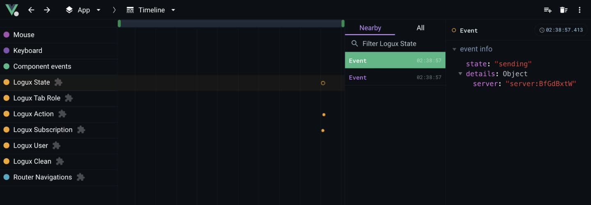

# Logux Vue Devtools


Logux is a new way to connect client and server. Instead of sending
HTTP requests (e.g., AJAX and GraphQL) it synchronizes log of operations
between client, server, and other clients.

* **[Guide, recipes, and API](https://logux.io/)**
* **[Chat](https://gitter.im/logux/logux)** for any questions
* **[Issues](https://github.com/logux/logux/issues)**
  and **[roadmap](https://github.com/orgs/logux/projects/1)**
* **[Projects](https://logux.io/guide/architecture/parts/)**
  inside Logux ecosystem

This repository contains plugin for [Vue devtools](https://github.com/vuejs/vue-devtools) browser extension
for debugging Logux application based on Vue.

<p align="center">
  
</p>

## Install

```sh
npm install --save-dev @logux/vue-devtools
```


## Usage

```js
import { createApp } from 'vue'
import { devtools } from '@logux/vue-devtools'

import { client } from './logux'

let app = createApp(…)

app.use(devtools, client, {
  layers: {
    state: false
  },
  ignoreActions: ['user/add']
})
```

## Extend

### Add custom event to the timeline

```js
import { createApp } from 'vue'
import { devtools, actionLayerId } from '@logux/vue-devtools'

import { client } from './logux'

let app = createApp(…)

app.use(devtools, client)

if (devtools.api) {
  devtools.api.addTimelineEvent({
    layerId: actionLayerId,
    event: {
      time: Date.now(),
      data: { … }
    }
  })
}
```
